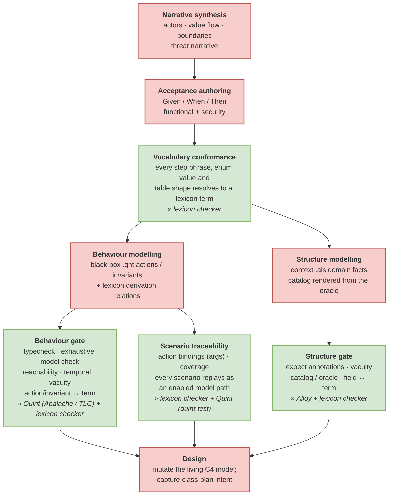
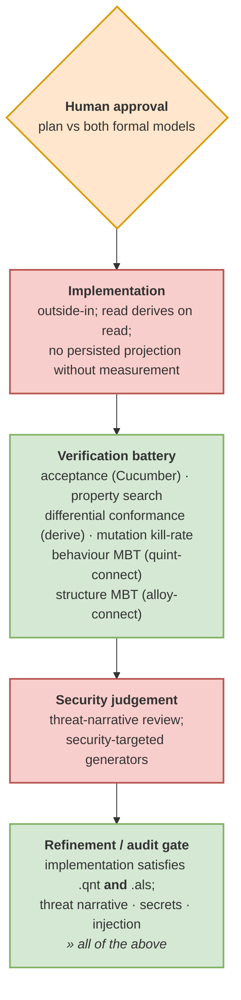

# HAM Harness

**H**uman / **A**gent / **M**odel — a process harness that puts deterministic
guardrails around LLM-aided engineering.

The harness is the process, the checks, and the tooling. The software being built
(the *app*) is a **separate repository**; this repo verifies it. Between a
natural-language story and working code, HAM inserts layers of increasing
formality — Gherkin, a lexicon, and formal models — and pins every
non-deterministic step with a mechanical, replayable check.

> If your process relies on careful consideration, prepare to be constantly
> disappointed. — Łukasz Langa

## The problem

An LLM generates code far faster than a human can read it, so "programming
through code review" defeats the point. The usual alternative — spec-driven
development — replaces verbose natural language with *more* verbose natural
language (heaps of Markdown), none of which can be verified except by reading
it carefully.

That leaves QA as a binary: either read all the code, or trust that it does what
the spec and the agent claim. Both are bad. An agent is an unreliable listener
(it may not have understood), an unreliable narrator (it may report work it did
not do), and inconsistent in its mistakes.

HAM takes the opposite direction: instead of slowing the model down, it spends
a fraction of the time code generation saves on **guardrails the code must pass**.

## The idea: stochastic generation, deterministic verification

The routine chain is `natural language → LLM → code`. HAM adds formal layers in
between, each paired with a tool-backed gate:

- **Gherkin** is the acceptance spec — structured enough to be executed and
  checked, readable by engineers and stakeholders alike.
- **The lexicon** (`*.yaml`) is the ubiquitous language: approved terms, step
  templates, table shapes, and the pure relations behind derived arithmetic. It
  is *data*, so it cannot silently drift from what is checked.
- **Quint** (`.qnt`) is the black-box behavioural model: commands, navigation,
  reachability, and history invariants.
- **Alloy** (`.als`) is the structural domain model: entities, relations,
  cardinalities, and fixed mappings that must hold in every state.

The model proposes; the checkers dispose. Because verification is deterministic,
a failed candidate is regenerated rather than patched, and a green gate means
"machine-checked" — not "the agent said so".

One owner per fact keeps the projections from bleeding into each other:

| Fact | Owner |
|---|---|
| Observable behaviour | `.qnt` model |
| Domain structure | `.als` model |
| Ubiquitous language, derived arithmetic | `lexicon/*.yaml` |
| Acceptance | Gherkin features |
| Security | threat narrative + audit |

## The pipeline

Each stage may be entered independently — there is no mandatory start. A story
stops at whichever rung of the verification gradient its risk justifies, and the
choice is recorded.

| # | Stage | Produces | Gate |
|---|---|---|---|
| 1 | `/story-map` | narrative + threat narrative | — |
| 2 | `/gherkin` | `features/*.feature` | `lexicon-check` |
| 3 | `/formalize` | `.qnt` + `.als` + lexicon relations | model checking, vacuity, coverage |
| 4 | `/explain` (plan) | living C4 + `class-plan.yaml` | human approval |
| 5 | `/bdd` | code + verification battery | acceptance, conformance, MBT, property, mutation |
| 6 | `/audit` | `audit-report.md` | security + refinement (hard gate) |
| 7 | `/explain` (as-built) | regenerated class model + diff | human decision |
| 8 | `/refactor` | internal change, semantics fixed | full regression replay |
| 9 | `/restructure` | context split / layering / persistence | `stories/**` + `lexicon/**` frozen |

Every stochastic act is immediately followed by a deterministic mechanism that
pins it down:



The delivery half is the same pattern: implementation is stochastic, the
verification battery is deterministic, and the security audit is a hard gate.



## Gates

Gate ids are **mechanism-level**, not tool names: a project can swap the tool
that implements a mechanism without renaming the gate. Five are required and
cannot be disabled: `vocabulary`, `acceptance`, `derived_conformance`, `audit`,
`as_built`. The rest are opt-in, per bounded context.

| Gate | Phase | Required | Mechanism | Tool |
|---|---|---|---|---|
| `vocabulary` | gherkin | ✓ | features speak the lexicon | lexicon checker |
| `model_behaviour` | formalize | | model check, reachability, vacuity | Quint (Apalache / TLC) |
| `scenario_coverage` | formalize | | action ↔ step bindings, path replay | lexicon checker + `quint test` |
| `model_structure` | formalize | | `expect 0/1`, vacuity, catalog | Alloy |
| `model_discipline` | formalize | | escape hatches / exemptions reported | discipline checker |
| `acceptance` | bdd | ✓ | run the features as tests | Cucumber |
| `derived_conformance` | bdd | ✓ | derived arithmetic vs read module | conformance harness |
| `property` | bdd | | invariant search over generated inputs | property engine |
| `mbt_behaviour` | bdd | | replay Quint traces, diff view state | quint-connect |
| `mbt_structure` | bdd | | replay Alloy traces, diff structure | alloy-connect |
| `mutation` | bdd | | kill-rate threshold | mutation engine |
| `audit` | audit | ✓ | security + formal equivalence | `/audit` skill |
| `as_built` | explain | ✓ | deterministic class model + plan diff | C4 / UML extractor |

The resolved set for a context comes from
`app/architecture/<context>/pipeline.yaml`, merged with
`pipeline/gates.yaml` and `pipeline/profiles.yaml`. Selection is deterministic:
required gates are injected, dependencies are checked, and unknown gates or
fields are rejected.

Green does not mean "nothing was skipped": every escape hatch from the
traceability chain is declared, shape-checked, and reported as residual risk by
`model_discipline`. A verification **attestation** (`scripts/attest.sh`) binds
the artifact to the spec + gate set it was checked against, so a later spec edit
that invalidates shipped code is detectable.

## The anchor

No change happens without an *anchor*: a `(stage, story, context)` that says
which part of the process the work belongs to. The gate is enforced at the tool
boundary by a Pi extension — unanchored writes and mutating commands are
refused, and a write under `app/stories/<X>/` requires `<X>` in the anchor. Any
stage may be the entry point; a failing gate re-anchors to the artifact that
owns it. See [`PROCESS-GATE.md`](PROCESS-GATE.md). The full workflow lives in
[`PROCESS.md`](PROCESS.md).

As a result, e.g. the agent is not allowed to change the stories and Gherkin
defining a behaviour (and driving BDD) when refactoring.

## Assumptions

HAM is opinionated about the shape of the app it guards:

- **Domain-driven design** — a ubiquitous language and bounded contexts are
  first-class.
- **Vertical-slice architecture** — features, not layers, bind a slice to a
  story.
- **Ports and adapters** — the domain is independent of transport and storage.
- **Read models derive on read** — no persisted projection without a
  measurement that demands it.
- **Rust** — the harness is language-agnostic in principle (all tools attach to
  language-neutral seams: `.feature`, `.qnt`, `.als`, `lexicon/*.yaml`, the
  `derive` boundary), but the container is built for a Rust app and the MBT
  crates are Rust.
- **Pi** — the agent runtime and the extension that enforces the anchor.

## Repository layout

```
PROCESS.md          the workflow (stage menu, gates, principles)
PROCESS-GATE.md     how the anchor is enforced
AGENTS.md           always-on anchor protocol for the agent
pipeline/           gate registry + named profiles
scripts/            one script per mechanism (the make targets call these)
tools/              Python: lexicon, arch, pipeline, attest checkers
containers/         Containerfile + run script for the pinned toolchain
.agents/skills/     the stage skills
.pi/                Pi extension + /anchor, /process commands
app/                the app repo (mounted; separate git repo)
alloy-connect/      the structure-MBT crate (mounted; separate git repo)
```

`app/` and `alloy-connect/` are gitignored — they are external repositories, and
their names and locations are configuration, not assumptions.

## Getting started

Requirements: `podman` (or Docker), a Rust app repository, and the
`alloy-connect` structure-MBT crate (a separate repo, mounted at
`alloy-connect/`).

```sh
# 1. Point the harness at the app and the MBT crate (gitignored .env)
cat > .env <<'EOF'
PI_APP=/absolute/path/to/app
APP_REPO=/absolute/path/to/app
APP_BIN=your-app
ALLOY_REPO=/absolute/path/to/alloy-connect
CONTEXT=your_context
EOF

# 2. Build the pinned toolchain image (Rust, Node, Python, Quint, Alloy, Java)
make build-pi

# 3. Launch the agent in the container
make run-pi
```

`make` targets are the **user's** interface. They run the underlying
`scripts/*.sh` inside the image with the app bind-mounted at `/workspace/app`.
The agent never invokes `make`; for any gate it runs the same underlying
commands directly.

```sh
make pipeline-check                       # validate the registry and context configs
make pipeline-plan CONTEXT=your_context   # print the resolved gate set
make pipeline-run  CONTEXT=your_context   # run every enabled automated gate
make model-discipline                     # report every declared escape hatch
make attest        CONTEXT=your_context   # write the verification attestation
make attest-check  CONTEXT=your_context   # fail if the attestation drifted
```

## Status

HAM is an experiment, developed alongside a single reference app (a household
budgeting ledger) that exercises it end to end. The process, the gate registry,
and the attestation mechanism are stable enough to run in CI; the skill set and
the per-context profiles are still moving. Expect the shape of the harness to
change as more of the reference app is put through it.

## Further reading

- [`PROCESS.md`](PROCESS.md) — the workflow in full
- [`PROCESS-GATE.md`](PROCESS-GATE.md) — the anchor, what is blocked, honest limits
- [`pipeline/gates.yaml`](pipeline/gates.yaml) — the closed gate catalogue
- [`pipeline/profiles.yaml`](pipeline/profiles.yaml) — named gate bundles
